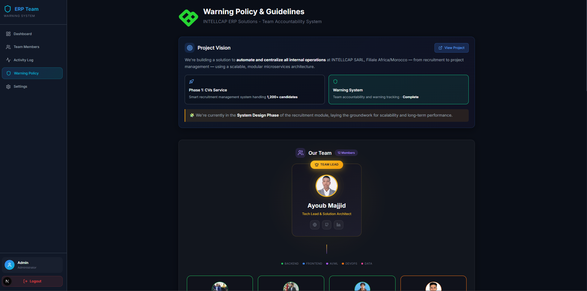

# 🚨 ERP Warning Management System

<p align="center">
  
</p>

<p align="center">
  <strong>Team Accountability & Warning Management Platform</strong><br/>
  Built for <a href="https://majjid.com/project.html?project=#intellcap-system">INTELLCAP ERP Solutions</a>
</p>

<p align="center">
  
  
  
</p>

---

## 🎯 About This Project

This **Warning Management System** was developed as part of the **INTELLCAP ERP Solutions** project to maintain team accountability, productivity, and professional standards across the organization.

### 💡 Project Vision

We're building a solution to **automate and centralize all internal operations** at INTELLCAP SARL, Filiale Africa/Morocco, INTELLCAP Corp. — from recruitment to project management — using a scalable, modular microservices architecture.

### 🔧 What We're Building (Phase 1)

| Service | Description | Status |
|---------|-------------|--------|
| 📄 **CVs Service** | Smart recruitment management system handling 1200+ candidates | In Progress |
| ⚠️ **Warning System** | Team accountability and warning tracking | ✅ Complete |
| 📊 **ERP Dashboard** | Centralized management interface | In Progress |

> 🧩 We're currently in the **System Design Phase** of the recruitment module, laying the groundwork for scalability and long-term performance.

---

## 👥 The Team

<table align="center">
  <tr>
    <td align="center" colspan="5">
      <h3>Team Leader</h3>
    </td>
  </tr>
  <tr>
    <td align="center" colspan="5">
      <br/>
      <strong>Ayoub Majjid</strong><br/>
      <sub>Tech Lead & Solution Architect</sub><br/>
      <a href="https://majjid.com">🌐 majjid.com</a> • <a href="https://github.com/ayoubmajid67">GitHub</a>
    </td>
  </tr>
</table>

### 📊 Team Structure

```
                           ┌─────────────────────┐
                           │   AYOUB MAJJID      │
                           │   Tech Lead &       │
                           │   Solution Architect│
                           └──────────┬──────────┘
                                      │
        ┌─────────────────────────────┼─────────────────────────────┐
        │                             │                             │
        ▼                             ▼                             ▼
┌───────────────┐           ┌───────────────┐           ┌───────────────┐
│  Backend Team │           │  AI/ML Team   │           │ Frontend Team │
└───────┬───────┘           └───────┬───────┘           └───────┬───────┘
        │                           │                           │
        ▼                           ▼                           ▼
   ┌─────────┐               ┌─────────┐                 ┌─────────┐
   │Alae     │               │Amal     │                 │Wafae    │
   │Eddine   │               │Lastak   │                 │El Kari  │
   └─────────┘               └─────────┘                 └─────────┘
   ┌─────────┐               ┌─────────┐                 ┌─────────┐
   │Ayman    │               │Nisrine  │                 │Ibtissam │
   │El Hilali│               │Amroug   │                 │Khannij  │
   └─────────┘               └─────────┘                 └─────────┘
   ┌─────────┐               ┌─────────┐                 ┌─────────┐
   │Brahim   │               │El Fahim │                 │Khadija  │
   │Bouaz    │               │Sana     │                 │Anhayfou │
   └─────────┘               └─────────┘                 └─────────┘
   ┌─────────┐                                          ┌─────────┐
   │Amine    │                                          │Yasser   │
   │Charro   │                                          │Touil    │
   └─────────┘                                          └─────────┘
```

### 👨‍💻 Team Members

<table>
  <tr>
    <td align="center">
      <br/>
      <sub>Alae Eddine<br/>Backend</sub>
    </td>
    <td align="center">
      <br/>
      <sub>Amal Lastak<br/>AI/ML</sub>
    </td>
    <td align="center">
      <br/>
      <sub>Amine Charro<br/>Backend</sub>
    </td>
    <td align="center">
      <br/>
      <sub>Ayman El Hilali<br/>DevOps</sub>
    </td>
    <td align="center">
      <br/>
      <sub>Brahim Bouaz<br/>Backend</sub>
    </td>
  </tr>
  <tr>
    <td align="center">
      <br/>
      <sub>El Fahim Sana<br/>AI/ML</sub>
    </td>
    <td align="center">
      <br/>
      <sub>Ibtissam<br/>Frontend</sub>
    </td>
    <td align="center">
      <br/>
      <sub>Khadija<br/>Frontend</sub>
    </td>
    <td align="center">
      <br/>
      <sub>Nisrine<br/>AI/ML</sub>
    </td>
    <td align="center">
      <br/>
      <sub>Wafae El Kari<br/>Frontend</sub>
    </td>
  </tr>
  <tr>
    <td align="center">
      <br/>
      <sub>Yasser Touil<br/>Frontend</sub>
    </td>
    <td></td>
    <td></td>
    <td></td>
    <td></td>
  </tr>
</table>

---

## ⚠️ Why This Warning System?

Managing a team of **17+ people** across multiple domains requires clear expectations and accountability. This system was built to:

1. **Establish Clear Expectations** - Document what's expected from every team member
2. **Fair Warning System** - Give members fair notice before any serious consequences  
3. **Maintain Productivity** - Ensure deadlines are met and communication flows
4. **Protect Team Morale** - Create accountability without micromanagement
5. **Enable Scaling** - As the team grows, the system scales with it

### 🔴 The 3-Warning Policy

| Warnings | Status | Action |
|----------|--------|--------|
| 0 | ✅ Good Standing | Keep it up! |
| 1 | ⚠️ First Notice | Review feedback |
| 2 | 🔶 At Risk | Final warning |
| 3 | ❌ Dropped | Access revoked |

---

## 📋 Table of Contents

- [Features](#-features)
- [Tech Stack](#-tech-stack)
- [Project Structure](#-project-structure)
- [Getting Started](#-getting-started)
- [Environment Variables](#-environment-variables)
- [API Documentation](#-api-documentation)
- [User Roles](#-user-roles)
- [Warning System](#-warning-system)
- [Member Management](#-member-management)
- [Security](#-security)
- [Contributing](#-contributing)

---

## ✨ Features

### 👨‍💼 Admin Features
- **Dashboard** - Overview of team statistics and warning charts
- **Member Management** - Add, view, disable members (local env only)
- **Warning System** - Issue warnings with documented reasons
- **Activity Log** - Complete audit trail of all admin actions
- **Warning Policy** - View and share team guidelines

### 👤 Member Features  
- **Personal Dashboard** - View status and notifications
- **Warning History** - Track personal warnings
- **Team Directory** - Browse team member profiles
- **Warning Policy** - Understand expectations

---

## 🛠 Tech Stack

| Category | Technology |
|----------|------------|
| **Framework** | Next.js 15 (App Router) |
| **Frontend** | React 19, CSS Modules |
| **Backend** | Next.js API Routes |
| **Database** | JSON file-based storage |
| **Authentication** | JWT + SHA-256 password hashing |
| **Email** | Nodemailer with Gmail SMTP |
| **Icons** | Lucide React |

---

## 📁 Project Structure

```
next-app/
├── src/
│   ├── app/
│   │   ├── admin/              # Admin pages
│   │   ├── dashboard/          # Member pages
│   │   ├── api/                # API routes
│   │   └── db/                 # JSON database
│   ├── components/             # Reusable components
│   ├── hooks/                  # Custom hooks
│   └── utils/                  # Utilities
├── public/
│   ├── assets/                 # Logo and static assets
│   └── profiles/               # Member profile directories
└── docs/                       # Documentation
```

---

## 🚀 Getting Started

```bash
# Clone repository
git clone https://github.com/ayoubmajid67/warnings_erp_project.git
cd warnings_erp_project/next-app

# Install dependencies
npm install

# Generate passwords (first time)
node src/utils/scripts/usersPasswordGenerator.js

# Run development server
npm run dev

# Open http://localhost:3000
```

---

## 🔐 Environment Variables

```env
NEXT_PUBLIC_APP_ENV=local   # 'local' or 'production'
JWT_SECRET=your-secret-key
SMTP_USER=your-gmail@gmail.com
SMTP_PASS=your-app-password
```

---

## 📡 API Documentation

| Endpoint | Method | Description |
|----------|--------|-------------|
| `/api/auth/login` | POST | User login |
| `/api/auth/logout` | POST | User logout |
| `/api/members` | GET | List members |
| `/api/members` | POST | Add member (local) |
| `/api/members` | DELETE | Disable member (local) |
| `/api/warnings` | POST | Issue warning |
| `/api/notifications` | GET/PATCH | Notifications |

---

## 👥 User Roles

| Role | Access | Session |
|------|--------|---------|
| **Admin** | Full system access | 1 hour |
| **Member** | Personal dashboard | 24 hours |

---

## 🔒 Security

- ✅ SHA-256 password hashing
- ✅ JWT with HttpOnly cookies
- ✅ Role-based access control
- ✅ Environment-based write restrictions
- ✅ Gitignored secrets

---

## 🔗 Related Links

- **Main ERP Project**: [majjid.com/project.html?project=#intellcap-system](https://majjid.com/project.html?project=#intellcap-system)
- **Team Leader Portfolio**: [majjid.com](https://majjid.com)
- **INTELLCAP**: Internal corporate platform

---

## 📞 Contact

**Project Lead**: Ayoub Majjid  
**Email**: ayoubmajid67@gmail.com  
**Website**: [majjid.com](https://majjid.com)  
**GitHub**: [@ayoubmajid67](https://github.com/ayoubmajid67)

---

<p align="center">
  <strong>Built with ❤️ by the INTELLCAP ERP Team</strong><br/>
  <sub>© 2025 INTELLCAP SARL - All Rights Reserved</sub>
</p>
